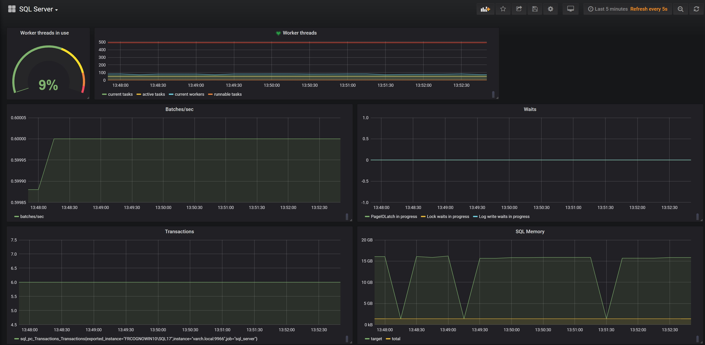
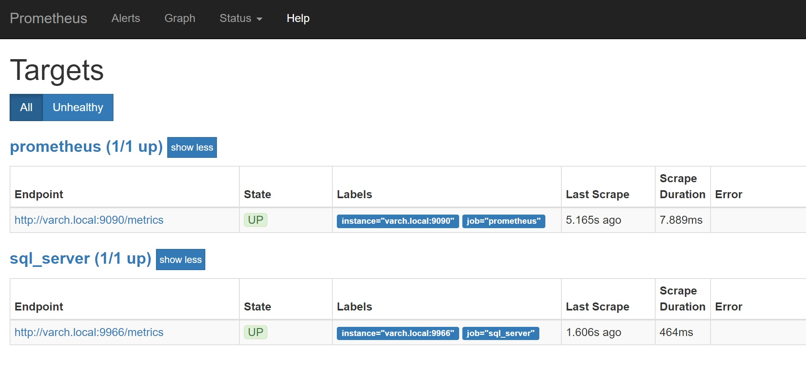

# Prometheus SQL Server exporter


> A prometheus exporter for the vital signs of Microsoft SQL Server instances

## Intro
[Prometheus](https://prometheus.io) and [Grafana](https://grafana.com) make easy to create insight in time driven data. [SQL Server](https://www.microsoft.com/en-us/sql-server/sql-server-2017) exports a lot of information but doesn't readily store and display it. Using this simple exporter you allow Prometheus to store SQL Server vital signs with no effort. The stored data can be used to create dashboards or alerts as usual with Prometheus/Grafana.

This is a very simple dashboard you can get with Grafana:



## Quick start

This is a dotnet core project so it will work on any platform. On Windows you might need to authorize the app to use the port.

1. Clone and build the project

```bash
git clone https://github.com/MindFlavor/prometheus_sql_server_exporter.git
cd prometheus_sql_server_exporter
dotnet build -c Release
```

2. Prepare the configuration file

```bash
cp sample/sample_config.json ~/exporter_config.json
vim ~/exporter_config # for info see below
```

3. Start the exporter

```bash
dotnet bin/Release/netcoreapp2.2/MindFlavor.SQLServerExporter.dll -c ~/exporter_config.json
```

4. Add the exporter to Prometheus scraping process

```bash
sudo vim /etc/prometheus/prometheus.yml # or wherever you Prometheus config file is
```

Add these lines: 

```yaml
  - job_name: 'sql_server'

    # Override the global default and scrape targets from this job every 5 seconds.
    scrape_interval: 5s

    static_configs:
      - targets: ['your_server_here:9966']
```

Restart Prometheus and check that the scraping is running as expected.



## Currently exported metrics

The exporter right now exports:

* [sys.dm_os_performance_counters](https://docs.microsoft.com/en-us/sql/relational-databases/system-dynamic-management-views/sys-dm-os-performance-counters-transact-sql)
* [sys.dm_os_schedulers](https://docs.microsoft.com/en-us/sql/relational-databases/system-dynamic-management-views/sys-dm-os-schedulers-transact-sql)

The exports are somewhat changed from the bare table to make them more suitable for Prometheus. For example, the schedulers export the parent node, scheduler id and cpu id as parameters, like this:

```
sql_os_schedulers_active_workers_count{instance="FRCOGNOWIN10\SQL17", parent_node_id="0", scheduler_id="6", cpu_id="6"} 9
```

This makes it possible to do interesting stuff in Grafana using Regexes (for example, you can plot the different worker threads per NUMA node).

## Docker

This is how you use it as container:

```bash
docker run -p 9966:9966 -v /home/mindflavor/:/config mindflavor:prometheus_sql_server_exporter
```

Where the mapped config folder contains the `config.json` file. 

To create the container:

```json
docker build --tag=prometheus_sql_server_exporter .
```

In the project root folder.

## Contributing

The project needs help! Just fork/open an issue/whatever, no formality is required. Please note, however, that any code you submit as pull request must comply with this project LICENSE.
